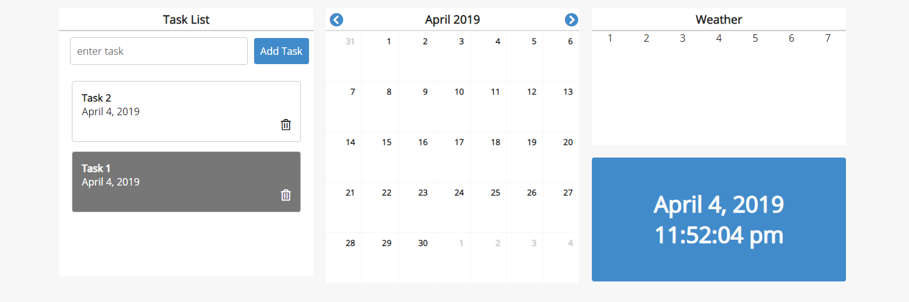

A productivity dashboard, to help organize my day. Built with React, date-fns, and Dark Sky weather API.

### Task List Component
- [ ] Add more info to tasks (date created, date to be finished, alarm, finished toggle)
- [x] Improve look of tasks
- [ ] Share state between Task List and Calendar to add tasks to Calendar
### Calendar Component
- [ ] Highlight current day
- [ ] Share state between Task List and Calendar to add tasks to Calendar
### Weather Component
- [x] Find a better API to get weather for the whole week
- [ ] Display 7 days with symbols / animated symbols and high/low temperatures
- [ ] Add styling
### Timer Component
- [ ] Add time zones
### General
- [ ] Improve heights and widths of components
- [ ] Create responsive design for mobile
- [ ] Add different color themes
- [ ] Add a backend for saving of Tasks / Calendar

### Wish List:
- [ ] Components which can be added/removed to make a customizable modular dashboard
- [ ] Pre-built layouts (fitness dashboard (workout component, weight component...)) 
